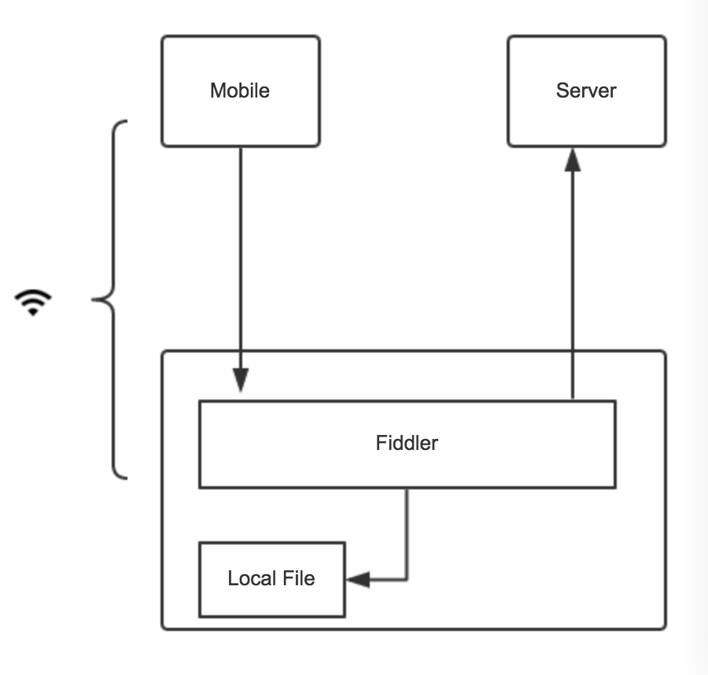
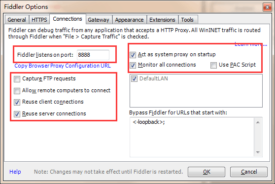
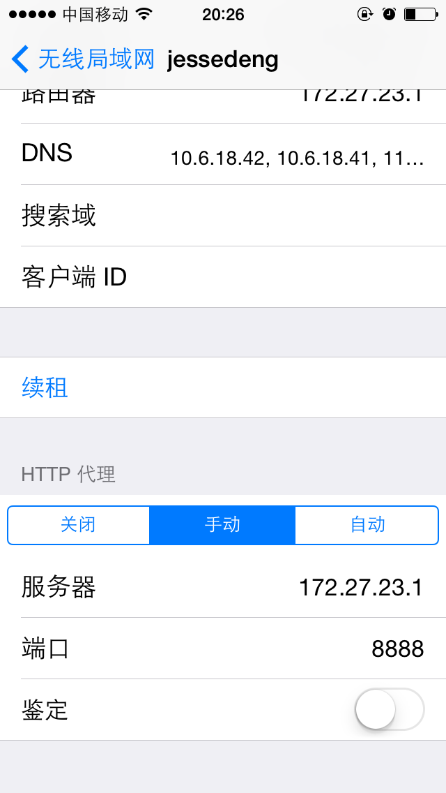

# 如何使用Fiddler调试移动web页面

## 原理图

## 简单说明（详细见后文教程）

* 手机和PC接入同一个网络，通常是同一个wifi（可以用PC创建一个wifi，现在有很多工具，如：[全名wifi](http://wifi.qq.com/)）
* 打开Fiddler中的网络监听，端口设为8888
* 将手机的网络代理服务器设置为PC的IP，端口设为8888
* 通过手机的http请求都会经过Fiddler，于是我们可以根据需要设置该请求是用本地文件代理或者直接请求服务器，并能看到http请求

## 详细教程

设置Fiddler

1. 打开Fiddler，执行菜单栏 Tools -> Fiddler Options 打开设置界面
2. 切换到Connections选项卡，如图设置和勾选

3. 如果要捕获https的请求，切换到HTTPS选项卡，勾选对应的选项

获取PC的IP地址

1. 打开命令行工具，运行 `ipconfig`
2. 无线局域网的IP地址，即我们需要的地址，这里是 `172.27.23.1`

设置iPhone代理

1. 设置 -> 无线局域网，点击当前连接的wifi
2. 滚动到HTTP代理栏，选择 “手动”，服务器填写PC的IP地址，端口号填写在Fiddler中设置的端口号，即8888

设置Android代理

1. 

运行截图
