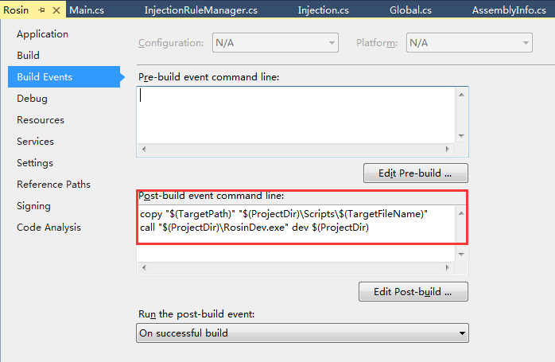

# Rosin编译教程

## 开发环境

* Microsoft Visual Studio Express 2013 for Windows Desktop
* Fiddler

## 编译步骤

1. 在Visual Studio中打开工程项目，注意这里的Fiddler版本
2. 执行菜单栏，BUILD -> ReBuild Solution，执行编译，执行前先关掉Fiddler
3. 编译生成的dll在bin或者release目录下
4. 编译后，会有一个后置脚本将dll拷贝到script目录，并运行RosinDev.exe拷贝到Fiddler的安装目录

